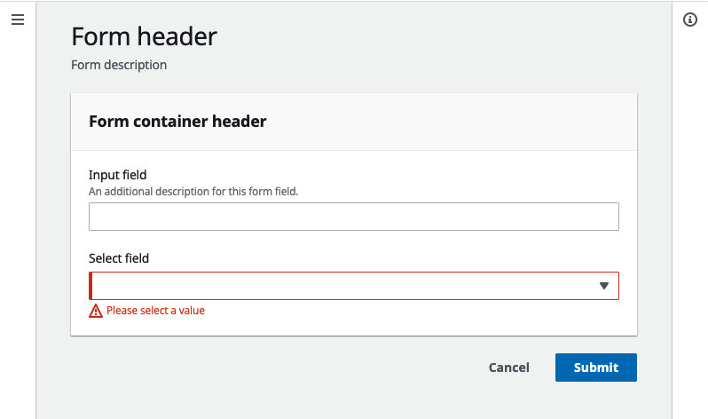

# Getting started with AWS UI Components

## Introduction

In 2017, AWS launched the AWS Design System to unify the customer experience across a vast portfolio of AWS services. The AWS Design System consists of human interface guidelines and user interface components that ensure a consistent, predictable experience for all AWS customers. It includes [AWS UI](https://www.npmjs.com/package/@awsui/components-react)—a collection of more than 50 React components that help create intuitive, responsive, and accessible interfaces for web applications.

AWS released the AWS UI components to NPM under the [Apache 2.0 open source license](https://www.apache.org/licenses/LICENSE-2.0.txt) in December 2020. In continuing with this release, we want to share the AWS Design System with the wider community. Anyone inside or outside of AWS looking to build custom experiences or projects can use the design system to meet their needs. This release is being staggered—so the rest of the system, including the documentation, will not be fully open sourced until early 2022.

This guide provides a short introduction on how to use the AWS UI components.

## Prerequisites

- Familiarity with building [React](https://reactjs.org/) applications and using [NPM](https://www.npmjs.com) modules.
- An existing React application (for example, created using [Create React App](https://reactjs.org/docs/create-a-new-react-app.html)).

## What's in the packages?

### [@awsui/components-react](https://www.npmjs.com/package/@awsui/components-react)

This is the main AWS UI package that contains the actual components. They're React components, with TypeScript definitions included, so this is the best place to start exploring.

### [@awsui/global-styles](https://www.npmjs.com/package/@awsui/global-styles)

In this package, you'll find global typography-related styles, including the [Noto Sans](https://www.google.com/get/noto/) font and base font sizes. Make sure you import it once into every AWS UI application to ensure consistent styling.

### [@awsui/collection-hooks](https://www.npmjs.com/package/@awsui/collection-hooks)

A set of React hooks that you can use to control the state of the Table and Cards components (as well as related components, such as TextFilter and Pagination).

### [@awsui/design-tokens](https://www.npmjs.com/package/@awsui/design-tokens)

With this package, you'll get a set of design tokens in a variety of formats, which you can use to build custom components that are visually consistent with the AWS Design System.

### [@awsui/test-utils-core](https://www.npmjs.com/package/@awsui/test-utils-core)

This internal package is used to create utilities for writing unit and integration tests.

## Using the components

### Step 1: Include the [AWS UI Global Styles](https://www.npmjs.com/package/@awsui/global-styles) package

The AWS UI Global Styles package contains global styles for AWS UI components, including the [Noto Sans](https://www.google.com/get/noto/) font and base font sizes.

#### 1. Install the package by running the following command:

```
npm install @awsui/global-styles
```

#### 2. Include the styles in your application by adding the following import to the main component/page of your application:

```
import "@awsui/global-styles/index.css"
```

### Step 2: Install the the [AWS UI React components](https://www.npmjs.com/package/@awsui/components-react)

#### 1. Install the package by running the following command:

```
npm install @awsui/components-react
```

#### 2. Import a component using the following syntax:

```
import ComponentName from "@awsui/components-react/{component-name}"
```

For example, to import the Button component:

```
import Button from "@awsui/components-react/button"
```

After you import it, you can use the component as you would any other React component:

```
<Button>Hello!</Button>
```

Note: You can import components using the following syntax, but this might result in a larger overall bundle size:

```
import { Button } from "@awsui/components-react"
```

### Step 3: View component properties

You can find a full list of components and documentation for those components' properties in the [components folder](./components/).

We also use TypeScript definitions to document component properties. If you're using a TypeScript-aware editor (such as [VSCode](https://code.visualstudio.com/)) you should see the full list of components, their available properties, and property types/accepted values via autocomplete/IntelliSense.

### Step 4: Build an example form

Now that you've downloaded and installed the component packages, you can get started building user interfaces. This walkthrough demonstrates how to use these components together by showing you how to build a simple form.



To build a form to capture user input, we recommend that you combine the following components:

- [_Form_](./components/form.md) – Provides the basic form structure, including header and actions slots for action buttons.
- [_Container_](./components/container.md) – Holds a group of related pieces of content, showing users that the items are related.
- [_Header_](./components/header.md) – Provides styling for header elements.
- [_SpaceBetween_](./components/space-between.md) – Adds consistent spacing between elements on your page.
- [_FormField_](./components/form-field.md) – Enables you to associate labels and descriptions with controls such as text inputs and selects.
- [_Input_](./components/input.md) – Provides a text input control, similar to the HTML `<input>` tag.
- [_Select_](./components/select.md) – Provides a select control, similar to the HTML `<select>` tag.

You can find a full working example using these components in the [example folder](./example/).

## Where can I find more documentation?

You can find a full list of components and documentation for those components' properties in the [components folder](./components/). Component properties are also documented via TypeScript definitions. If you’re using a TypeScript-aware editor (such as [VSCode](https://code.visualstudio.com/)) you should see the full list of components, their available properties, and property types/accepted values via autocomplete/IntelliSense.

## Having problems?

Contact us by [opening an issue](http://github.com/aws/awsui-documentation/issues).

## Security

See [CONTRIBUTING](CONTRIBUTING.md#security-issue-notifications) for more information.

## License Summary

The documentation is made available under the Creative Commons Attribution-ShareAlike 4.0 International License. See the LICENSE file.

The sample code within this documentation is made available under the MIT-0 license. See the LICENSE-SAMPLECODE file.
